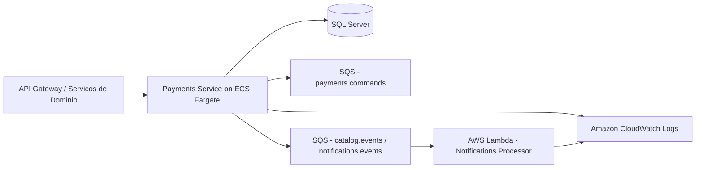
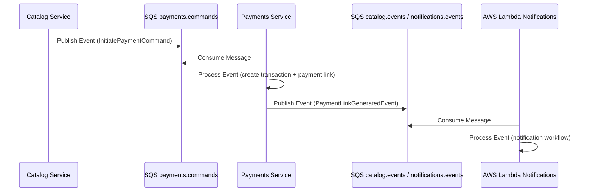
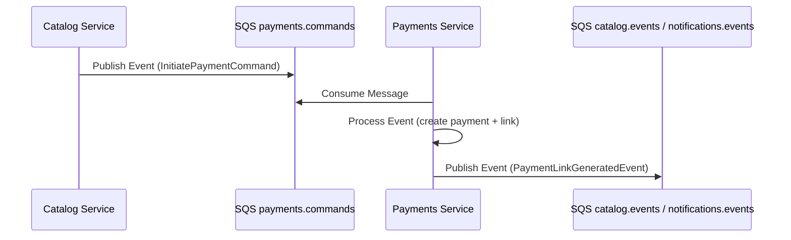
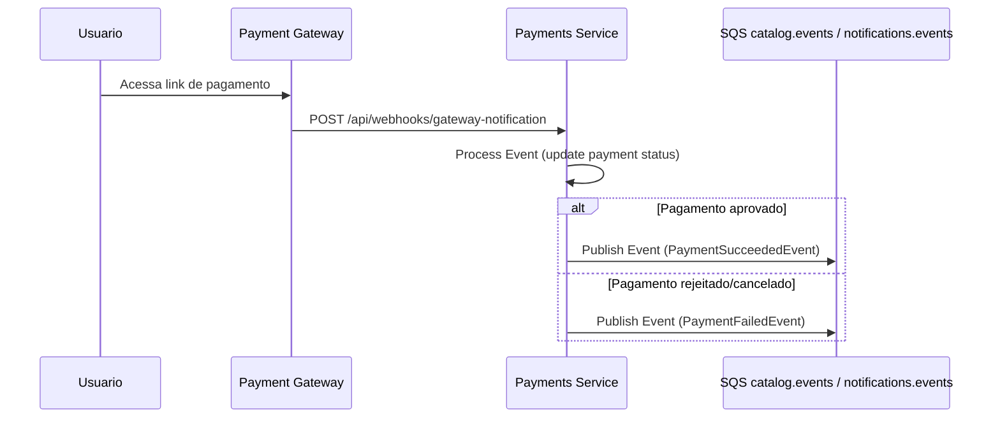
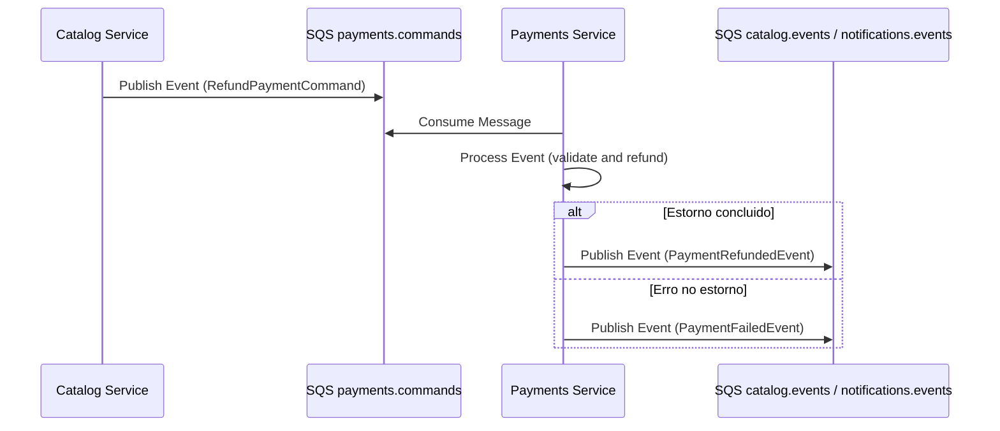

# FIAP Cloud Games - Microsservico de Pagamentos (Fase 4)


[](https://github.com/FIAP-10NETT-Grupo-30/cloud-games-fase-4-payments/tags)

Microsservico responsavel pelo ciclo de pagamentos da plataforma FIAP Cloud Games: criacao de transacoes, processamento de callback do gateway, estornos e publicacao de eventos para os demais servicos da plataforma.

## Sumario

- [Arquitetura AWS (Fase 4)](#arquitetura-aws-fase-3)
- [Diagrama de Arquitetura](#diagrama-de-arquitetura)
- [Fluxo Assincrono](#fluxo-assincrono)
- [Responsabilidades do Microsservico](#responsabilidades-do-microsservico)
- [Fluxos de Integracao](#fluxos-de-integracao)
- [Como Rodar o Projeto](#como-rodar-o-projeto)
- [Estrutura de Pastas](#estrutura-de-pastas)
- [Arquitetura do Projeto (Clean Architecture)](#arquitetura-do-projeto-clean-architecture)
- [Tecnologias Utilizadas](#tecnologias-utilizadas)
- [Variaveis de Ambiente](#variaveis-de-ambiente)
- [Repositorios Relacionados](#repositorios-relacionados)

---

## Arquitetura AWS (Fase 4)

A entrega da Fase 4 e executada integralmente em AWS, com deploy de servicos conteinerizados, mensageria assincrona e processamento orientado a eventos.

Servicos AWS utilizados:

- Amazon ECR para versionamento e armazenamento de imagens
- Amazon ECS com Fargate para execucao do microsservico
- Amazon SQS para filas e intercambio assincrono de mensagens
- AWS Lambda para processamento de notificacoes orientadas a evento
- Amazon CloudWatch para logs, metricas e observabilidade operacional
- Terraform (via repositorio de orquestracao) para provisionamento de infraestrutura

---

## Diagrama de Arquitetura




---

## Fluxo Assincrono




---

## Responsabilidades do Microsservico

- Gerar links de pagamento a partir de comandos recebidos
- Processar callbacks do gateway no endpoint de webhook
- Atualizar status de transacoes (Succeeded, Failed, Cancelled, Refunded)
- Processar solicitacoes de estorno
- Publicar eventos de dominio para os servicos de Catalogo e Notificacoes
- Expor endpoint HTTP para simulacao e validacao de callbacks de pagamento

---

## Fluxos de Integracao

### 1. Iniciacao de Pagamento



Entrada:

- Queue: payments.commands
- Message: InitiatePaymentCommand
- Campos: OrderId, Amount, UserId, UserEmail

Saida:

- Queue: catalog.events e notifications.events
- Event: PaymentLinkGeneratedEvent
- Campos: OrderId, UserEmail, PaymentTransactionId, PaymentLinkUrl

### 2. Processamento de Pagamento (Webhook)



Endpoint:

- URL: POST /api/webhooks/gateway-notification
- Header: X-WEBHOOK-API-KEY
- Payload: PaymentGatewayCallbackDto

### 3. Estorno de Pagamento



Entrada:

- Queue: payments.commands
- Message: RefundPaymentCommand
- Campos: OrderId, UserId, Reason

Saida:

- Queue: catalog.events e notifications.events
- Events: PaymentRefundedEvent, PaymentFailedEvent

---

## Como Rodar o Projeto

### Pre-requisitos

- Git
- .NET SDK 8+
- SQL Server acessivel para a aplicacao
- dotnet-ef (restaurado via tool manifest)

### Execucao local com .NET

1. Clonar o repositorio

   ```bash
   git clone https://github.com/FIAP-10NETT-Grupo-30/cloud-games-fase-4-payments.git
   cd cloud-games-fase-4-payments
   ```

2. Restaurar ferramentas e dependencias

   ```bash
   dotnet tool restore
   dotnet restore ./cloud-games-fase-4-payments.sln
   ```

3. Configurar secrets locais

   ```bash
   cd src/Fiap.CloudGames.Worker
   dotnet user-secrets init
   dotnet user-secrets set "ConnectionStrings:DefaultConnection" "Server=localhost,1433;Database=CloudGamesPayments;User Id=sa;Password=SuaSenha;TrustServerCertificate=True;"
   dotnet user-secrets set "PaymentSettings:WebhookApiKey" "your-local-api-key-for-testing"
   ```

4. Aplicar migracoes

   ```bash
   cd ../../
   dotnet ef database update --project src/Fiap.CloudGames.Infrastructure --startup-project src/Fiap.CloudGames.Worker --context AppDbContext
   ```

5. Executar o servico

   ```bash
   dotnet run --project src/Fiap.CloudGames.Worker
   ```

6. Validar endpoints

- Swagger UI: http://localhost:5000/swagger
- OpenAPI JSON: http://localhost:5000/swagger/v1/swagger.json
- Health check live: http://localhost:5000/health/live
- Health check ready: http://localhost:5000/health/ready

### Deploy e infraestrutura em AWS

Provisionamento, pipelines e infraestrutura de execucao em AWS estao centralizados no repositorio de orquestracao:

- https://github.com/FIAP-10NETT-Grupo-30/cloud-games-fase-4-orchestration-aws

---

## Estrutura de Pastas

```text
.
├── .config/
├── src/
│   ├── Fiap.CloudGames.Worker/
│   ├── Fiap.CloudGames.Application/
│   │   └── Payments/
│   ├── Fiap.CloudGames.Domain/
│   │   └── Payments/
│   ├── Fiap.CloudGames.Infrastructure/
│   │   ├── Payments/
│   │   └── Persistence/
│   └── Fiap.CloudGames.Payments.Lambda/
├── tests/
│   └── Fiap.CloudGames.Tests/
├── Dockerfile
├── cloud-games-fase-4-payments.sln
└── README.md
```

---

## Arquitetura do Projeto (Clean Architecture)

O microsservico adota Clean Architecture para isolamento de responsabilidades e evolucao segura de regras de negocio.

Camadas:

- Worker: exposicao HTTP, composicao da aplicacao e bootstrap
- Application: casos de uso, handlers, eventos e contratos de aplicacao
- Domain: entidades, enums e contratos de dominio
- Infrastructure: persistencia, integracoes externas e implementacoes tecnicas
- Lambda: publicacao/processamento de eventos para notificacoes na arquitetura AWS

---

## Tecnologias Utilizadas

- .NET 8 / ASP.NET Core
- Entity Framework Core (SQL Server)
- AWS SDK for .NET (SQS)
- AWS Lambda (.NET)
- Amazon ECS Fargate
- Amazon ECR
- Amazon SQS
- Amazon CloudWatch
- Terraform (repositorio de orquestracao)
- Swagger / OpenAPI
- Serilog

---

## Variaveis de Ambiente

### Runtime da aplicacao

| Variavel | Descricao | Exemplo |
|---|---|---|
| ASPNETCORE_ENVIRONMENT | Ambiente de execucao | Development |
| ConnectionStrings__DefaultConnection | Connection string do banco de dados | Server=localhost,1433;Database=CloudGamesPayments;User Id=sa;Password=***;TrustServerCertificate=True; |
| PaymentSettings__WebhookApiKey | API key para autenticacao do webhook | your-local-api-key-for-testing |
| Queues__Payments__Commands | Nome da fila de comandos de pagamentos | payments.commands |
| Queues__Payments__Events | Nome da fila de eventos de pagamentos | payments.events |
| Queues__Catalog__Events | Nome da fila de eventos de catalogo | catalog.events |
| Queues__Notifications__Events | Nome da fila de eventos de notificacoes | notifications.events |

### Runtime da Lambda

| Variavel | Descricao | Exemplo |
|---|---|---|
| PAYMENTS_NOTIFICATIONS_QUEUE_URL | URL da fila SQS de notificacoes | https://sqs.us-east-1.amazonaws.com/123456789012/payments-notifications |
| CORRELATION_ID | Correlation ID para rastreabilidade do evento | 9f1d0c4a-7f2e-4f86-9f17-7bb6f9f1e2ac |

---

## Repositorios Relacionados

- Orquestracao AWS: https://github.com/FIAP-10NETT-Grupo-30/cloud-games-fase-4-orchestration-aws
- Usuarios: https://github.com/FIAP-10NETT-Grupo-30/cloud-games-fase-4-users
- Catalogo: https://github.com/FIAP-10NETT-Grupo-30/cloud-games-fase-4-catalog
- Notificacoes: https://github.com/FIAP-10NETT-Grupo-30/cloud-games-fase-4-notifications